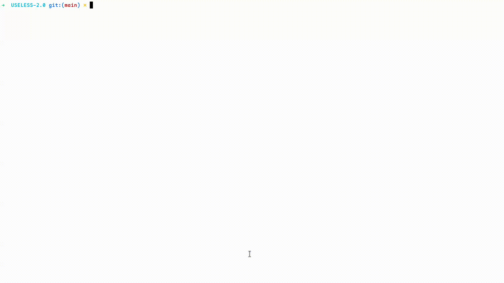

# Terminal presentation tool 🎯
## Basic Details
### Team Name: SYNTAX ERROR
### Team Members
- Harikrishna Mohan - CEMP
- Muhammed Shafi A.S - CEMP

### Project Description
This Lua-based project reads a JSON file and generates a styled terminal-based presentation.
It supports **colored text**, **typewriter effects**, **delays**, **ASCII art banners**, and **custom line separators**.
Ideal for retro-style CLI slideshows and event countdowns.

### The Problem (that doesn't exist)
Tired of navigating gui's for creating ppts' for my presentations

### The Solution (that nobody asked for)
Yet another presentation software for simple ideas and announcements
or advertising

## Technical Details
### Technologies/Components Used
For Software:
- Language used: Lua programming language
- libraries used: dkjson for parsing json files
- tools: chat gpt for creating ascii letters, and assisting me, nothing more

### Implementation
# Requirements
1. Need a linux environment to run it since it uses systemcalls
2. Lua version 5.1 or >
3. luarocks to install dependency packages

# Installation steps
1. install lua and luarocks on your linux environment
2. `git clone https://github.com/LxHacky/USELESS-2.0.git`
3. `cd USELESS-2.0`
2. `luarocks install dkjson`
	> use sudo privilages if needed
3. chmod +x init.lua
# Run
`./init.lua <input file>`

example: `./input.lua demo.json`
### Project Documentation

## **JSON File Structure**

A presentation is defined in a JSON file with the following top-level keys:

| Key              | Type   | Description                                                           |
| ---------------- | ------ | --------------------------------------------------------------------- |
| `width`          | Number | Width of the horizontal lines (default: 80).                          |
| `line_character` | String | Character to use when drawing lines.                                  |
| `body`           | Array  | A list of **slides**, where each slide contains one or more entities. |

---

### **Slide Structure**

A slide is an **array** of entities.
An **entity** can be:

1. `"line"` → Draws a horizontal line.
2. `"newline"` → Prints a blank line.
3. `"refresh"` → Clears the terminal.
4. **Paragraph object**:

   ```json
   {
     "paragraph": {
       "text": "Some text here",
       "attributes": {
         "color": "red",         // Optional: text color
         "delay": "1",           // Optional: seconds to wait before showing
         "effect": "typewriter"  // Optional: animation effect
       }
     }
   }
   ```
5. **ASCII Art object**:

   ```json
   {
     "ascii": {
       "text": "HELLO",
       "attributes": {
         "color": "blue",   // Optional
         "delay": "0.5"     // Optional
       }
     }
   }
   ```

---

### **Available Colors**

* `black`, `red`, `green`, `yellow`, `blue`, `magenta`, `cyan`, `white`, `grey`

---

### **Example JSON**

```json
{
  "width": 80,
  "line_character": "-",
  "body": [
    [
      { "paragraph": { "text": "Starting...", "attributes": { "color": "red" } } },
      "newline",
      { "paragraph": { "text": "3...", "attributes": { "color": "red", "delay": "1", "effect": "typewriter" } } },
      { "paragraph": { "text": "2...", "attributes": { "color": "yellow", "delay": "1", "effect": "typewriter" } } },
      { "paragraph": { "text": "1...", "attributes": { "color": "green", "delay": "1", "effect": "typewriter" } } },
      "newline",
      "line",
      { "ascii": { "text": "WELCOME", "attributes": { "color": "cyan" } } }
    ]
  ]
}
```

---

> you can use the demo.json file to view a demo
# Project Demo


## Team Contributions
- Hari: implementation
- Shafi: idea and minor contributions
---
Made with ❤ at TinkerHub Useless Projects


